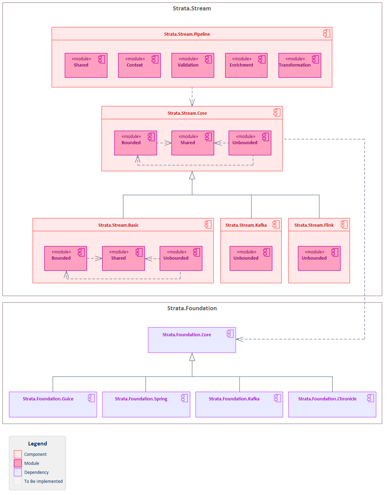

# Strata.Stream

[]()
[]()

Stream processing components and utilities for building robust, scalable enterprise streaming applications in the Strata Framework Set. This library provides core stream abstractions, Apache Flink integration, Apache Kafka integration, pipeline processing, and enterprise patterns for building high-performance stream processing applications.

## Purpose
- Provide a unified developer experience across popular frameworks, libraries, and language platforms.
- Reduce impedance mismatch between different technologies.
- Facilitate rapid development of enterprise-grade applications with best practices and design patterns.

## Features

- **Core Stream Abstractions**: Essential interfaces and utilities for enterprise stream processing application development
- **Bounded and Unbounded Streams**: Comprehensive support for both finite and infinite data streams
- **Apache Flink Integration**: High-performance distributed stream processing with Flink runtime
- **Apache Kafka Integration**: Type-safe Kafka producers, consumers, and Avro serialization support
- **Pipeline Processing**: Advanced pipeline context management with step tracking and error handling
- **Stream Transformations**: Rich set of transformation operations including map, filter, flatMap, and windowing
- **Event-Driven Architecture**: Stream-based event handling and processing capabilities
- **Error Recovery**: Comprehensive exception handling and recovery mechanisms for stream processing

## Architecture

The Strata.Stream framework follows a modular architecture with clear separation of concerns:



Each component builds upon the core stream abstractions while providing specialized functionality for specific streaming use cases and enterprise patterns.

## Components

### Strata.Stream.Core

The foundational streaming component that provides essential abstractions and utilities for enterprise stream processing:

**Modules:**
- `strata.stream.core.shared` - Core stream abstractions and utilities
  - IStream interface for basic stream operations (filter, map, flatMap)
  - IStreamable and IStreamExecution for stream lifecycle management
  - IFunction, IPredicate, IKeySelector for functional stream operations
  - StreamExecutionStatus for monitoring stream execution state
  - TimeAmount for temporal operations and windowing
- `strata.stream.core.bounded` - Finite stream processing
  - IBoundedStream for operations on finite data sets
  - IKeyedBoundedStream for keyed stream operations
  - ICountWindowedBoundedStream for count-based windowing
  - IBoundedStreamSource and IBoundedStreamSink for data ingestion and output
  - AbstractBoundedStreamSource base implementation
- `strata.stream.core.unbounded` - Infinite stream processing
  - IUnboundedStream for continuous data stream operations
  - IUnboundedStreamSource and IUnboundedStreamSink for streaming data flow
  - IUnboundedStreamExecutor for stream execution management
  - ProcessMethodAccessor for advanced stream processing patterns

### Strata.Stream.Basic

Basic stream processing implementations providing concrete implementations of core abstractions:

**Features:**
- Reference implementations of core stream interfaces
- Basic stream operators and transformations
- Simple in-memory stream processing capabilities
- Testing and development utilities

### Strata.Stream.Flink

Apache Flink integration component providing distributed stream processing capabilities:

**Modules:**
- `strata.stream.flink.unbounded` - Flink unbounded stream integration
  - FlinkExecutableUnboundedStream for Flink-powered stream execution
  - FlinkExecutionDriver for managing Flink job lifecycle
  - FlinkExecutionResult for execution monitoring and results
  - TimestampAssigner for event time processing
  - StreamSinkAdapter and SinkWriterAdapter for output integration
  - KafkaAvroSource for Kafka-Flink integration with Avro serialization
  - StreamOfStreamsConverter for complex stream topologies
  - SinkAdapter for flexible sink implementations

### Strata.Stream.Kafka

Apache Kafka integration component providing messaging and event streaming capabilities:

**Features:**
- Kafka source and sink implementations
- Avro schema registry integration
- Type-safe Kafka producers and consumers
- Stream-Kafka bridge for seamless integration
- Kafka Streams compatibility

### Strata.Stream.Pipeline

Pipeline processing component providing advanced workflow and context management:

**Modules:**
- `strata.stream.pipeline.context` - Pipeline execution context
  - IPipelineContext for pipeline step management
  - AbstractPipelineContext base implementation with logging
  - PipelineStep for individual step tracking and status
  - StepStatus enumeration for step lifecycle states
  - IPipelineContextFactory for context creation
- `strata.stream.pipeline.transformation` - Data transformation utilities
  - ITransformer and ITransformerMapper for data transformations
  - TransformerMapper implementation for mapping operations
  - TransformationFailedException for transformation error handling
- `strata.stream.pipeline.enrichment` - Data enrichment capabilities
  - IEnricherMapper for data enrichment operations
- `strata.stream.pipeline.shared` - Shared pipeline utilities
  - PipelineException for pipeline-specific error handling

## Installation

### Gradle

Add the following dependencies to your `build.gradle`:

```gradle
dependencies {
    implementation 'strata.stream:strata-stream-core:1.0-SNAPSHOT'
    implementation 'strata.stream:strata-stream-basic:1.0-SNAPSHOT'
    implementation 'strata.stream:strata-stream-flink:1.0-SNAPSHOT'
    implementation 'strata.stream:strata-stream-kafka:1.0-SNAPSHOT'
    implementation 'strata.stream:strata-stream-pipeline:1.0-SNAPSHOT'

    // For testing
    testImplementation 'strata.stream:strata-stream-core-test:1.0-SNAPSHOT'
    testImplementation 'strata.stream:strata-stream-basic-test:1.0-SNAPSHOT'
    testImplementation 'strata.stream:strata-stream-flink-test:1.0-SNAPSHOT'
    testImplementation 'strata.stream:strata-stream-kafka-test:1.0-SNAPSHOT'
    testImplementation 'strata.stream:strata-stream-pipeline-test:1.0-SNAPSHOT'
}
```

### Maven

Add the following dependencies to your `pom.xml`:

```xml
<dependencies>
    <dependency>
        <groupId>strata.stream</groupId>
        <artifactId>strata-stream-core</artifactId>
        <version>1.0-SNAPSHOT</version>
    </dependency>
    <dependency>
        <groupId>strata.stream</groupId>
        <artifactId>strata-stream-basic</artifactId>
        <version>1.0-SNAPSHOT</version>
    </dependency>
    <dependency>
        <groupId>strata.stream</groupId>
        <artifactId>strata-stream-flink</artifactId>
        <version>1.0-SNAPSHOT</version>
    </dependency>
    <dependency>
        <groupId>strata.stream</groupId>
        <artifactId>strata-stream-kafka</artifactId>
        <version>1.0-SNAPSHOT</version>
    </dependency>
    <dependency>
        <groupId>strata.stream</groupId>
        <artifactId>strata-stream-pipeline</artifactId>
        <version>1.0-SNAPSHOT</version>
    </dependency>

    <!-- For testing -->
    <dependency>
        <groupId>strata.stream</groupId>
        <artifactId>strata-stream-core-test</artifactId>
        <version>1.0-SNAPSHOT</version>
        <scope>test</scope>
    </dependency>
    <dependency>
        <groupId>strata.stream</groupId>
        <artifactId>strata-stream-basic-test</artifactId>
        <version>1.0-SNAPSHOT</version>
        <scope>test</scope>
    </dependency>
    <dependency>
        <groupId>strata.stream</groupId>
        <artifactId>strata-stream-flink-test</artifactId>
        <version>1.0-SNAPSHOT</version>
        <scope>test</scope>
    </dependency>
    <dependency>
        <groupId>strata.stream</groupId>
        <artifactId>strata-stream-kafka-test</artifactId>
        <version>1.0-SNAPSHOT</version>
        <scope>test</scope>
    </dependency>
    <dependency>
        <groupId>strata.stream</groupId>
        <artifactId>strata-stream-pipeline-test</artifactId>
        <version>1.0-SNAPSHOT</version>
        <scope>test</scope>
    </dependency>
</dependencies>
```

### Repository Configuration

This package is published to GitHub Packages. Add the repository to your build configuration:

```gradle
repositories {
    maven {
        name "GitHubPackages"
        url "https://maven.pkg.github.com/StrataFrameworkSet/repository"
        credentials {
            username = project.findProperty("gpr.user") ?: System.getenv("USERNAME")
            password = project.findProperty("gpr.key") ?: System.getenv("TOKEN")
        }
    }
}
```

## Usage

### Bounded Stream Examples

```java
import strata.stream.core.bounded.IBoundedStream;
import strata.stream.basic.bounded.BasicBoundedStream;

// Create bounded stream from finite data
IBoundedStream<String> boundedStream = BasicBoundedStream.of(
    List.of("apple", "banana", "cherry", "date")
);

// Apply transformations to bounded data
IBoundedStream<String> processed = boundedStream
    .filter(item -> item.length() > 4)
    .map(String::toUpperCase);

// Count-based windowing on bounded streams
ICountWindowedBoundedStream<String> windowed = boundedStream
    .window(3);  // Process in batches of 3

// Keyed bounded stream operations
IKeyedBoundedStream<Integer, String> keyedStream = boundedStream
    .keyBy(String::length)
    .filter(item -> item.startsWith("a"));
```

### Unbounded Stream Examples

```java
import strata.stream.core.unbounded.IUnboundedStream;
import strata.stream.core.unbounded.IExecutableUnboundedStream;
import strata.stream.core.shared.TimeAmount;

// Create unbounded stream from continuous data source
IUnboundedStream<Event> unboundedStream = createEventStream();

// Apply transformations to streaming data
IExecutableUnboundedStream<ProcessedEvent> processed = unboundedStream
    .filter(event -> event.getTimestamp().isAfter(Instant.now().minus(Duration.ofHours(1))))
    .map(event -> new ProcessedEvent(event.getId(), event.getData().toUpperCase()));

// Time-based windowing for unbounded streams
ITimeWindowedUnboundedStream<Event> timeWindowed = unboundedStream
    .windowBy(TimeAmount.minutes(5));

// Keyed partitioning for parallel processing
IKeyedUnboundedStream<String, Event> keyedUnbounded = unboundedStream
    .keyBy(event -> event.getCustomerId())
    .filter(event -> event.isValid());

// Execute the unbounded stream
IUnboundedStreamExecutor executor = processed.getExecutor();
IStreamExecution execution = executor.execute();
```

### Pipeline Examples

#### Pipeline Context Management

```java
import strata.stream.pipeline.context.IPipelineContext;
import strata.stream.pipeline.context.InitialContext;
import strata.stream.pipeline.context.ToStringContext;
import strata.stream.pipeline.context.ToUpperContext;

// Create initial pipeline context
InitialContext initial = InitialContext.of(42L);

// Execute pipeline steps with tracking
InitialContext processed = initial
    .startStep("validation")
    .completeStep()
    .startStep("normalization") 
    .completeStep();

// Access step history
List<PipelineStep> steps = processed.getAccumulatedSteps();
Optional<PipelineStep> currentStep = processed.getCurrentStep();
```

#### Pipeline Validation

```java
import strata.stream.pipeline.validation.ISyntacticValidatorFilter;
import strata.stream.pipeline.validation.ISemanticValidatorFilter;
import strata.stream.pipeline.validation.SyntacticValidatorFilter;
import strata.stream.pipeline.validation.SemanticValidatorFilter;

// Syntactic validation
ISyntacticValidatorFilter<Long, InitialContext> syntacticFilter =
    new SyntacticValidatorFilter<>(
        context -> context.getValue() != null && context.getValue() > 0
    );

// Semantic validation  
ISemanticValidatorFilter<Long, InitialContext> semanticFilter =
    new SemanticValidatorFilter<>(
        context -> context.getValue() % 2 == 0  // Even numbers only
    );

// Apply validation to pipeline context
InitialContext context = InitialContext.of(42L);
boolean syntacticallyValid = syntacticFilter.test(context);
boolean semanticallyValid = semanticFilter.test(context);
```

#### Pipeline Transformation

```java
import strata.stream.pipeline.transformation.ITransformerMapper;
import strata.stream.pipeline.transformation.TransformerMapper;

// Define transformation between context types
ITransformerMapper<InitialContext, ToStringContext> toStringTransformer =
    new TransformerMapper<>(
        initial -> new ToStringContext(
            "Value=" + initial.getValue(),
            initial.getAccumulatedSteps()
        )
    );

ITransformerMapper<ToStringContext, ToUpperContext> toUpperTransformer =
    new TransformerMapper<>(
        toString -> new ToUpperContext(
            toString.getValue().toUpperCase(),
            toString.getAccumulatedSteps()
        )
    );

// Apply transformations in pipeline
InitialContext initial = InitialContext.of(42L)
    .startStep("transformation")
    .completeStep();

ToStringContext stringContext = toStringTransformer.apply(initial);
ToUpperContext upperContext = toUpperTransformer.apply(stringContext);

// Result: "VALUE=42"
String result = upperContext.getValue();
```

#### Pipeline Enrichment

```java
import strata.stream.pipeline.enrichment.IEnricherMapper;

// Define enrichment logic
IEnricherMapper<ToStringContext, EnrichedContext> enricher =
    context -> {
        String enrichedValue = context.getValue() + " [ENRICHED]";
        return new EnrichedContext(enrichedValue, context.getAccumulatedSteps());
    };

// Apply enrichment to pipeline context
ToStringContext context = new ToStringContext("Original Value", List.of());
EnrichedContext enriched = enricher.enrich(context);
```

### Flink Integration Examples

```java
import strata.stream.flink.unbounded.FlinkExecutableUnboundedStream;
import strata.stream.flink.unbounded.FlinkExecutionDriver;
import strata.stream.flink.unbounded.FlinkExecutionResult;

// Create Flink-powered unbounded stream
FlinkExecutableUnboundedStream<Event> flinkStream = 
    new FlinkExecutableUnboundedStream<>(eventSource);

// Configure Flink execution
FlinkExecutionDriver driver = new FlinkExecutionDriver();
FlinkExecutionResult result = driver.execute(flinkStream);

// Monitor execution status
StreamExecutionStatus status = result.getStatus();
```

### Kafka Integration Examples

```java
import strata.stream.flink.unbounded.KafkaAvroSource;

// Create Kafka source with Avro serialization
KafkaAvroSource<OrderEvent> kafkaSource = 
    new KafkaAvroSource<>("order-events-topic", OrderEvent.class);

// Integrate Kafka source with stream processing
IUnboundedStream<OrderEvent> orderStream = createStream(kafkaSource)
    .filter(order -> order.getAmount().compareTo(BigDecimal.valueOf(100)) > 0)
    .map(order -> enrichOrderWithCustomerData(order));

// Execute stream with Flink
FlinkExecutableUnboundedStream<OrderEvent> executable = 
    (FlinkExecutableUnboundedStream<OrderEvent>) orderStream;
```

## Building

### Prerequisites

- Java 11 or higher
- Gradle 7.0 or higher
- Apache Flink 2.1.0 or higher (for Flink integration)
- Apache Kafka 3.9.1 or higher (for Kafka integration)

### Build Commands

```bash
# Build all components
./gradlew build

# Run tests
./gradlew test

# Publish to local repository
./gradlew publishToMavenLocal

# Publish to GitHub Packages (requires credentials)
./gradlew publish
```

### Project Structure

```
Strata.Stream/
├── Components/
│   ├── Strata.Stream.Core/         # Core stream abstractions and utilities
│   ├── Strata.Stream.Basic/        # Basic stream processing implementations
│   ├── Strata.Stream.Flink/        # Apache Flink integration
│   ├── Strata.Stream.Kafka/        # Apache Kafka integration
│   └── Strata.Stream.Pipeline/     # Pipeline processing and context management
├── Tests/
│   ├── Strata.Stream.CoreTest/     # Core component tests and fixtures
│   ├── Strata.Stream.BasicTest/    # Basic implementation tests
│   ├── Strata.Stream.FlinkTest/    # Flink integration tests
│   ├── Strata.Stream.KafkaTest/    # Kafka integration tests
│   └── Strata.Stream.PipelineTest/ # Pipeline processing tests
├── build.gradle                    # Root build configuration
├── settings.gradle                 # Gradle settings
└── README.md                       # This file
```

## Requirements

- Java 11 or later
- Apache Flink 2.1.0 or later (for Flink integration)
- Apache Kafka 3.9.1 or later (for Kafka integration)
- Spring Boot 3.1.3 or later (for Spring integration)
- Hibernate 5.6.11.Final or later (for persistence integration)
- Gradle 7.0+ or Maven 3.6+

## Contributing

We welcome contributions to the Strata.Stream project! Please follow these guidelines:

1. **Fork the repository** and create your feature branch from `development`
2. **Follow the coding standards** established in the existing codebase
3. **Write tests** for your changes and ensure all existing tests pass
4. **Update documentation** as needed for your changes
5. **Submit a pull request** with a clear description of your changes

### Development Setup

1. Clone the repository:
   ```bash
   git clone https://github.com/StrataFrameworkSet/Strata.Stream.git
   cd Strata.Stream
   ```

2. Build the project:
   ```bash
   ./gradlew build
   ```

3. Run tests to ensure everything works:
   ```bash
   ./gradlew test
   ```

### Code Style

- Follow Java and TypeScript naming conventions
- Use meaningful variable and method names
- Add appropriate JavaDoc/TSDoc comments for public APIs
- Maintain consistent indentation and formatting
- Write comprehensive unit tests for new functionality
- Follow stream processing architectural patterns consistently
- **Interface Naming**: Prefix all interfaces with "I" (e.g., `IStream`, `IUnboundedStream`, `IPipelineContext`)
- **Method Chaining**: Setters should return reference to "this" to enable fluent method chaining

## License

This project is licensed under the Apache License 2.0 - see the [LICENSE](LICENSE) file for details.

## Support

For questions, issues, or contributions, please:

1. Check the [Issues](https://github.com/StrataFrameworkSet/Strata.Stream/issues) page for existing questions
2. Create a new issue if your question hasn't been addressed
3. For development discussions, join our community channels

## Related Projects

- [Strata.Foundation](https://github.com/StrataFrameworkSet/Strata.Foundation) - Foundational components and utilities

---

**Strata.Stream** is part of the Strata Framework Set, providing enterprise-grade stream processing components for building scalable, maintainable streaming applications.
